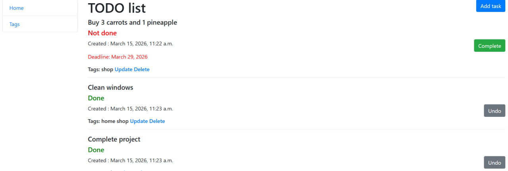

# Todo list

Project for managing personal tasks and their tags.

## Installation

Python 3 must be already installed.

```shell
git clone https://github.com/TataKeymi/todo_list.git
cd todo_list
python -m venv venv
venv\Scripts\activate
pip install -r requirements.txt
python manage.py migrate
python manage.py runserver
```

## Features

* Create and manage tasks
* Mark tasks as complete or undo
* Set task deadlines
* Tag tasks
* Django admin interface

## Demo


